# Zoom Clone Coding

bash로 작성된 것은 vscode내의 terminal에서 작성한 코드이다.


## #0 INTRODUCTION

Need to know

**Backend**

ExpressJS, app.get(), Pug, (req, res) => 

**Frontend**

Vanilla JS(document.querySelector, document.createElement, document.innerText) 

package.json, babel, .classList.add(), document.createElement


**<u>:heavy_check_mark: Node.js version check</u>**

**cmd**

v14.17.3 이상의 버전 필요

```
node -v
```


### Server Setup

NodeJS 서버 설정

```bash
$ mkdir zoom
$ cd zoom
$ npm init -y
```


**package.json**

```json
{
  "name": "zoom",
  "version": "1.0.0",
  "description": "",
  "main": "index.js",
  "scripts": {
    "test": "echo \"Error: no test specified\" && exit 1"
  },
  "keywords": [],
  "author": "",
  "license": "ISC"
}
```

:x:main, scripts 삭제

```json
{
  "name": "zoom",
  "version": "1.0.0",
  "description": "Zoom Clone using WebRTC and Websockets.",
  "keywords": [],
  "author": "",
  "license": "ISC"
}
```

:heavy_check_mark:원하면 description, license 입력


:heavy_check_mark:Github

```bash
$ touch README.md
```


**Nodemon**

```bash
$ npm i nodemon -D
```

**babel**

babel.config.json 파일 생성

```bash
$ touch babel.config.json
```


```bash
$ touch nodemon.json
$ mkdir src
$ cd src
$ touch server.js
$ cd ..
```

**server.js**

```js
console.log("hello");
```


```bash
$ git init .
```

```bash
$ npm i @babel/core @babel/cli @babel/node -D
```

```bash
$ touch .gitignore
```

**.gitignore**

```
/node_modules
```

**nodemon.json**

exec 명령어가 다음 것을 실행하도록하는 것

```json
{
  "exec": "babel-node src/server.js"
}
```


```bash
$ npm i @babel/preset-env -D
```

**babel.config.json**

```json
{
  "presets": ["@babel/preset-env"]
}
```

**package.json**

:heavy_check_mark:scripts 추가 및 작성

```json
{
  "name": "zoom",
  "version": "1.0.0",
  "description": "",
  "keywords": [],
  "author": "",
  "license": "ISC",
  "scripts": {
    "dev": "nodemon"
  },
  "devDependencies": {
    "@babel/cli": "^7.18.6",
    "@babel/core": "^7.18.6",
    "@babel/node": "^7.18.6",
    "@babel/preset-env": "^7.18.6",
    "nodemon": "^2.0.18"
  }
}

```


**install**

```bash
$ npm i express
$ npm i pug
```

**src/server.js**

express app 생성, 포트 3000을 listen

```js
import express from "express";

const app = express();

console.log("hello");

app.listen(3000);
```

```bash
$ npm run dev
```

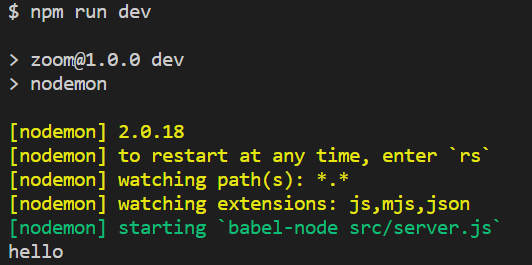

**localhost:3000**

Cannot GET /

이 화면에 표시된다.


### Frontend Setup


:heavy_check_mark: static files 등 유저가 보게될 파일들을 생성

:heavy_check_mark:webpack은 사용하지 않을 것! JS를 유저에게 보내고 브라우저가 이해할 수 있도록 한다.

```bash
$ cd src
$ mkdir public
$ cd public
$ mkdir js
$ cd js
$ touch app.js
```

```bash
$ cd src
$ mkdir views
$ cd views
$ touch home.pug
```


**server.js**

```js
import express from "express";

const app = express();

app.set("view engine", "pug");
app.set("views", __dirname + "/views");
console.log("hello");

app.listen(3000);
```

:cactus:기존 코드에서 현재 코드에 변경사항이 있었다. 이를 반영한 코드는 다음과 같다.

```js
import express from "express";

const app = express();

app.set("view engine", "pug");
app.set("views", __dirname + "/views");

const handleListen = () => console.log(`Listening on http://localhost:3000`);
app.listen(3000, handleListen);
```

:heavy_check_mark:route 생성

express의 역할: views를 설정, render

나머지 부분은 websocket에서 실시간으로 일어나는 것

:checkered_flag: pug로 view engine 설정, express에 template위치 지정, public url 생성하여 유저에게 공유

```js
import express from "express";

const app = express();

app.set("view engine", "pug");
app.set("views", __dirname + "/views");

app.get("/", (req, res) => res.render("home"));
const handleListen = () => console.log(`Listening on http://localhost:3000`);
app.listen(3000, handleListen);
```


**home.pug**

```pug
doctype html
html(lang="en")
    head
        meta(charset="UTF-8")
        meta(http-equiv="X-UA-Compatible", content="IE=edge")
        meta(name="viewport", content="width=device-width, initial-scale=1.0")
        title Noom
    body 
        h1 It works!
```

script 추가

```pug
doctype html
html(lang="en")
    head
        meta(charset="UTF-8")
        meta(http-equiv="X-UA-Compatible", content="IE=edge")
        meta(name="viewport", content="width=device-width, initial-scale=1.0")
        title Noom
    body 
        h1 It works!
        script(src="public/js/app.js")
```

:heavy_plus_sign: **server.js**

```js
import express from "express";

const app = express();

app.set("view engine", "pug");
app.set("views", __dirname + "/views");
app.use("/public", express.static(__dirname + "/public"));
app.get("/", (req, res) => res.render("home"));
const handleListen = () => console.log(`Listening on http://localhost:3000`);
app.listen(3000, handleListen);
```

`http://localhost:3000/public/js/app.js`이 연결된다.

**public/js/app.js**

```js
hello;
```

`http://localhost:3000/public/js/app.js`에 hello;가 출력된다.

유저에게 보여지는 FrontEnd에 사용되는 app.js를 저장할 때마다 nodemon이 새로 시작된다.

:red_circle: views나 서버를 수정할 때만 nodemon이 재시작 되는 것을 원한다.

**nodemon.json**

public폴더를 무시하도록 한다.

```json
{
  "ignore": ["src/public/*"],
  "exec": "babel-node src/server.js"
}
```


**views/home.pug**

MVP CSS

```js
doctype html
html(lang="en")
    head
        meta(charset="UTF-8")
        meta(http-equiv="X-UA-Compatible", content="IE=edge")
        meta(name="viewport", content="width=device-width, initial-scale=1.0")
        title Noom
        link(rel="stylesheet" href="https://unpkg.com/mvp.css")
    body 
        header
            h1 Noom
        button Call
        script(src="public/js/app.js")
```


Fianl code would be

```js
doctype html
html(lang="en")
    head
        meta(charset="UTF-8")
        meta(http-equiv="X-UA-Compatible", content="IE=edge")
        meta(name="viewport", content="width=device-width, initial-scale=1.0")
        title Noom
        link(rel="stylesheet" href="https://unpkg.com/mvp.css")
    body 
        header
            h1 Noom
        main 
            h2 Welcome to Noom
        script(src="public/js/app.js")
```


### Recap

Nodemon은 우리의 프로젝트를 살펴보고 변경사항이 있을 시 서버를 재시작해주는 프로그램

서버를 재시작하는 대신에 babel-node을 실행하게 되는데 Babel은 작성도니 코드를 일반 NodeJS코드로 컴파일해준다.

그 작업을 src/server.js파일에 해준다.

```json
{
  "ignore": ["src/public/*"],
  "exec": "babel-node src/server.js"
}
```


**server.js**

express를 import

express application을 구성

view engine을 Pug로 설정

views 디렉토리 설정

public파일에도 동일하게 설정

**public 파일들은 FrontEnd에서 구동되는 코드**

public/js/app.js - FrontEnd에서 구동

views/server.js - BackEnd에서 구동

`app.user("/public", express.static(__dirname + "/public"));`로 public 폴더를 유저에게 공개해 준다.

`app.get("/", (req, res) => res.render("home"));` 홈페이지로 이동 시 사용될 템플릿 렌더링

`link(rel="stylesheet" href="https://unpkg.com/mvp.css")` MVP CSS

`app.get("/*", (req, res) => res.redirect("/"));` 다시 home으로 돌아오게 하는 코드


## #1 CHAT WITH WEBSOCKETS

### Introduction

채팅프로그램을 만들 것이다.

1. 메시지 보내기, 받기
2. 닉네임
3. 방
4. event활용: 참여, 퇴장, 인원수


### HTTP vs WebSockets

How realtime works

* WebSocket

HTTP와 WebSocket 모두 프로토콜이다.

**HTTP**

User sends request, Server send response를 반복한다.

Backend는 user을 기억하지 못한다. (stateless)

user와 Backend 사이의 연결이 없다.

Server는 request를 받으면 response를 해준다.

:heavy_check_mark: authetification, cookie

❗ real-time 아니다

1. request를 보내주어야 한다.
2. server가 user에게 아무것도 못해준다.

**WebSockets**

webSocket을 사용해서 연결하고 싶고, 서버가 지원한다면 wss하면 된다.

`https://nomadcoders.co` :arrow_forward: `wss://nomadcoders.com`

:pencil2:<u>How it works, why it allows us real-time stuff</u>

webSocket connection이 일어날 때 마지 악수처럼 작동한다.

Browser가 Server로 webSocket request를 보내면, Server는 accept or deny.

한 번 accept되면 연결은 establish된다. = 말 그대로 연결되었다.

연결되어 있기 때문에 Server은 User가 누구인지 기억할 수 있다.

Server가 User에게 request를 기다리지 않고 메시지를 보낼 수 있다.

"bi-directional connection" : Both Browser and Server have direct line one and other.

:heavy_check_mark: 브라우저에는 내장된 webSocket API가 있다.

:heavy_check_mark:webSocket은 Browser와 Backend 사이에서만 발생하는 것 아니다. 두개의 Server에서도 가능!


### WebSockets in Node.JS

node.js로 webSocket Server를 만드는데 ws package을 활용

ws: simple to use, blazing fast, and thoroughtly tested WebSocket client and server implementation.

:heavy_check_mark:implementation

규칙이 되는 Protocol, 그 다음 개발자들이 그 규칙에 Code를 녹여내는 것!

(Http, WebSockets = Protocol)

ws는 webSocket protocol을 실행하는 package이다!

:x:Chat room은 ws에 포함되어 있지 않다. Chat room은 webSocket protocol이 아니기 때문이다.

Chat room을 구현하기 위해서는 logic을 구현해야한다.

:heavy_check_mark:ws를 사용한 framework 중 이미 채팅방 기능이 있는 framework가 존재한다.

**ws is core and foundation of webSocket, basic thing!**


```bash
$ npm i ws
```

Server를 만들지만 ws server을 만들지는 않을 것이다.

Express서버를 두고 함께 합칠 것이다. 왜냐하면 다른 protocol이기 때문이다.

Express handles HTTP but now ws.

**server.js**

`const handleListen = () => console.log(`Listening on ws://localhost:3000`);`

`import http from "http";`

`const server = http.createServer(app);` : createserver

:heavy_check_mark:http는 Node.js에 이미 설치되어 있다.

이제 server에서 webSocket을 만들 수 있다.

`import WebSocket from "ws";`

`const wss = new WebSocket.Server({server})` - Server를 추가하는 것은 필수가 아니다.

: create websocket server, pass the server

:arrow_forward:run http server also webSocket server will start.

http와 ws 모두가 3000번 port에 있기를 원하기 때문에 하는 것이다.

```js
import http from "http";
import WebSocket from "ws";
import express from "express";

const app = express();

app.set("view engine", "pug");
app.set("views", __dirname + "/views");
app.use("/public", express.static(__dirname + "/public"));
app.get("/", (_, res) => res.render("home"));
app.get("/*", (_, res) => res.render("/"));
const handleListen = () => console.log(`Listening on ws://localhost:3000`);

const server = http.createServer(app);
const wss = new WebSocket.Server({server});

server.listen(3000, handleListen);
```

**결과**

http Server에 access하려는 것

http Server위에서 webSocket server를 만들도록한 것

이유: create server(보이게 노출)하고 http server server위에 ws server를 만들기 위한 것이다.

localhost 3000는 동일한 port에서 http, ws requeset 두개를 다 처리할 수 있다.


### WebSocket Events

ws을 사용해서 backend와 frontend사이 Connection을 만든다.

:heavy_check_mark:FrontEnd에서 Browser가 이미 webSocket 클라이언트에 대해 implementation을 가지고 있다. (추가 설치X)

Backend을 webSocket을 이용하여 연결해주고 싶다면 JS가 해줄 것

<u>FrontEnd에서는 추가로 install할 것이 없다.</u>

**HTTP**

url 선언

User가 url로 이동

req와 res을 받고 response를 보낸다.

**webSocket**

FrontEnd와 유사하다.

event가 있고, event가 있을 때 사용할 function을 만든다.

이미 존재하는 event명도 존재하고 없는 event명도 존재한다. (주의!)

<u>(remaind) JS는 event의 정보와 같이 function을 호출</u>**webSocket도 유사하다**

event명: submit

function명: fn

```js
function fn(event){
    
}
form.addEventListener("submit", fn)
```


**server.js**

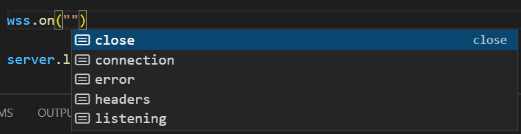

callback으로 socket을 받는다.

여기서 socket이란? 연결된 어떤 사람, 연결된 browser와의 contact line

socket을 이용하면 메세지를 주고 받을 수 있다.

We need to able to save this some where or at least console.log.

```js
function handleConnection(socket) {
  console.log(socket);
};

wss.on("connection", handleConnection);
```

:heavy_check_mark:checkpoint

on method에서는 event가 happend하는 것을 기다린다.

위 코드의 경우 event가 connection이고, 또 on method에서 function을 받는데 connection이 happend하면 작동한다.

또한 on method은 backend에 연결된 사람의 정보를 제공해 준다.

이 정보는 socket을 통해서 온다.

socket is the connetion between server and browser.

**위 코드의 방식은 JS에서 자주 사용하는 방식으로 차후 변경 예정**

```js
import http from "http";
import WebSocket from "ws";
import express from "express";

const app = express();

app.set("view engine", "pug")
app.set("views", __dirname + "/views");
app.use("/public", express.static(__dirname + "/public"));
app.get("/", (_, res) => res.render("home"));
app.get("/*", (_, res) => res.render("/"));

const handleListen = () => console.log(`Listening on ws://localhost:3000`);

const server = http.createServer(app);
const wss = new WebSocket.Server({server});

function handleConnection(socket) {
  console.log(socket);
}

wss.on("connection", handleConnection);

server.listen(3000, handleListen);
```


:exclamation:이제 FrontEnd 변경이 필요하다.

FrontEnd와 BackEnd을 연결해야한다.

연결이 되면 **server.js에 작성한 console에서 socket을 볼 수 있다.**

**app.js**

```js
const socket = new WebSocket("http://localhost:3000");
```

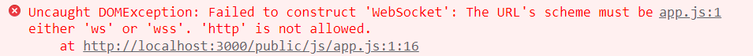

:x: 오류가 발생!

Because it's a different protocol.

Option 1:

**app.js**

```js
const socket = new WebSocket("ws://localhost:3000");
```

Option 2:

1. localhost:3000을 쓰지 않고 싶다.

2. console에서 `window.location`확인

   host: "localhost:3000"을 확인 가능

```js
const socket = new WebSocket(`ws://${window.location.host}`);
```

새로고침하면 TERMINAL창에 우리가 필요한 socket이 출력된다.

이 중 webSocket은 브라우저와 서버사이의 연결이다.

```js
function handleConnection(socket) {
  console.log(socket);
}
```

console.log(socket)의 socket이 frontend와 real-time(실시간)으로 소통할 수 있다.

frontend에도 물론 socket이 있다.

각각의 socket 모두 메시지를 주고 받을 수 있다.

:black_flag:check

server.js의 socket은 연결된 browser

app.js의 socket은 connection to server


### WebSocket Messages

선호하는 코드는 큰 하나의 function 안에 기능들을 넣는 것이다.

So,

connection안에 같은 역할을 하는 익명함수를 만들 것이다.

####  server.js

**before**

```js
function handleConnection(socket) {
  console.log(socket);
}

wss.on("connection", handleConnection);
```

**after**

```js
wss.on("connection", (socket) => {
  console.log(socket);
});
```


:exclamation:Now, socket의 메서드를 사용해보자!

Which is "sending message"

```js
wss.on("connection", (socket) => {
  console.log("Connected to Browser ✔");
  socket.send("hello!");
});
```

아직 메세지를 보내기만 했기 때문에 출력되는 값이 없다.


#### app.js

message는 event이다!

```js
const socket = new WebSocket(`ws://${window.location.host}`);

socket.addEventListener("open", () => {
  console.log("Connected to Server ✔");
});
```

새로고침하면 다음과 같이 console창에 출력된다.

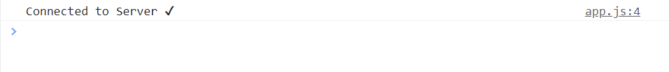

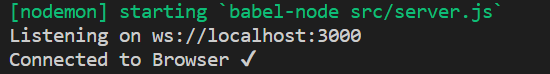

```js
const socket = new WebSocket(`ws://${window.location.host}`);

socket.addEventListener("open", () => {
  console.log("Connected to Server ✔");
});

socket.addEventListener("message", (message) => {
  console.log("Just got this:", message.data, "from the server");
});

socket.addEventListener("close", () => {
  console.log("Disconnected to Server ❌");
});
```


#### 정리 & 결과

**server.js**에서 connection이 생겼을때 socket으로 즉시 메세지를 보낸다.

`socket.send("hello!")`

**app.js** 3개의 event에 대해 listen하고 있다.

1. open: connection이 open되면 출력

   `console.log("Connected to Server ✔")`

2. message: message를 받을 때마다 내용을 출력

   `console.log("Just got this:", message, "from the server");`

3. close: server가 오프라인이 될때 출력

   `console.log("Connected to Server ❌");`

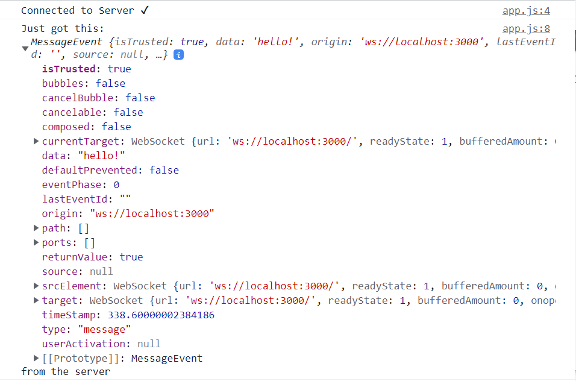

:heavy_check_mark:data, timestamp..

```js
socket.addEventListener("message", (message) => {
  console.log("Just got this:", message.data, "from the server");
});
```

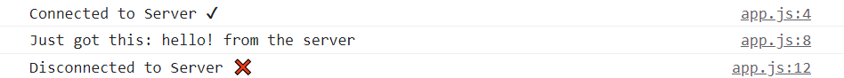


#### server.js

**before**

```js
wss.on("connection", (socket) => {
  console.log("Connected to Browser ✔");
  socket.send("hello!");
});
```

**after**

```js
wss.on("connection", (socket) => {
  console.log("Connected to Browser ✔");
  socket.on("close", () => console.log("Disconnected from Browser ❌"));
  socket.send("hello!");
});
```

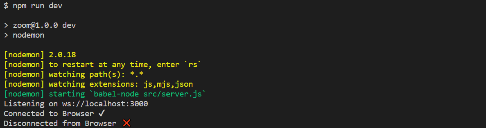

As you can see "Bi-directional!"

Browser의 연결이 끊기면(탭을 닫으면) 서버에 event를 발생시키고 server가 오프라인이 되면 browser에 알려준다.


:checkered_flag:

:question: Frontend에서 보낸 메세지를 Backend에서 받는 방법을 모른다.

BUT Backend에서 Frontend로 보낸 메세지를 받는 방법은 안다.

**app.js**수정

```js
socket.addEventListener("message", (message) => {
  console.log("New message:", message.data);
});
```


#### Send message from Frontend to Backend

Step 1: Send message

setTimeout을 활용(10초를 기다린다.)

**app.js**

```js
setTimeout(() => {
  socket.send("hello from the browser!");
}, 10000);
```

**server.js**

`socket.on("message", message => {console.log(message); });`

Browser가 server에 message을 보냈을 때를 위해 listener를 등록했다.

이제 Brower에서 보낸 "hello from the browser!"을 Backend에서 받을 수 있는지 를 확인하자!

```js
wss.on("connection", (socket) => {
  console.log("Connected to Browser ✔");
  socket.on("close", () => console.log("Disconnected from Browser ❌"));
  socket.on("message", message => {
    console.log(message);
  });
  socket.send("hello!");
});
```

**결과**

Listening on ws://localhost:3000
Connected to Browser ✔
<Buffer 68 65 6c 6c 6f 20 66 72 6f 6d 20 74 68 65 20 62 72 6f 77 73 65 72 21>
Disconnected from Browser ❌

```js
wss.on("connection", (socket) => {
  console.log("Connected to Browser ✔");
  socket.on("close", () => console.log("Disconnected from Browser ❌"));
  socket.on("message", message => {
    console.log(message.toString());
  });
  socket.send("hello!");
});
```

**결과**

Listening on ws://localhost:3000
Connected to Browser ✔
hello from the browser!
Disconnected from Browser ❌

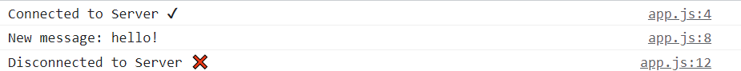


### Recap

listening event in two places: Backend and Frontend

Backend: 

create websocket server (connection happend!)

listen event which is connection

when connection event happend we have to react and we have information about who connected.

javascrtip will put the socket just connected - Browser

Now we can listen for the event on the browser specifically on the socket that just connected

close the connection(close the browser tab or computer goes to sleep)

socket.on means add event listener to specific socket not the server


Frontend:

opening the connection to server

and event listener

socket.addEventListenter

Frontend can send things to Backend(also Backend can send thins to Frontend)

* Frontend `addEventListener("message")`
* Backend `socket.on("message")`


In our code we used anoymous function.

`socket.on("close", ()=> console.log("Disconnected from the Browser"))`

**confusing part**

which part do i working on? check the file name

Must know: working part(Frontend or Backend), When they happend


### Chat Completed

**home.pug**

make button to send the message

```pug
doctype html
html(lang="en")
    head
        meta(charset="UTF-8")
        meta(http-equiv="X-UA-Compatible", content="IE=edge")
        meta(name="viewport", content="width=device-width, initial-scale=1.0")
        title Noom
        link(rel="stylesheet" href="https://unpkg.com/mvp.css")
    body 
        header
            h1 Noom
        main
            ul
            form
                input(type="text", placeholder="write a message", required)
                button Send
        script(src="public/js/app.js")
```

ul에는 메시지 리스틑 넣을 것!

추가된 ul과 form을 에 만들어준다.

**app.js**

:heavy_check_mark: `event.preventDefault();`가 없다면 재부팅된다.

```js
const messageList = document.querySelector("ul");
const messageForm = document.querySelector("form");
const socket = new WebSocket(`ws://${window.location.host}`);
socket.addEventListener("open", () => {
  console.log("Connected to Server ✔");
});

socket.addEventListener("message", (message) => {
  console.log("New message:", message.data);
});

socket.addEventListener("close", () => {
  console.log("Disconnected to Server ❌");
});

function handleSubmit(event){
  event.preventDefault();
  const input = messageForm.querySelector("input");
  socket.send(input.value);
  input.value = "";
};

messageForm.addEventListener("submit",handleSubmit);
```


input에 작성한 message가 backend로 간다.


**server.js**

```js
import http from "http";
import WebSocket from "ws";
import express from "express";

const app = express();

app.set("view engine", "pug");
app.set("views", __dirname + "/views");
app.use("/public", express.static(__dirname + "/public"));
app.get("/", (_, res) => res.render("home"));
app.get("/*", (_, res) => res.render("/"));
const handleListen = () => console.log(`Listening on ws://localhost:3000`);

const server = http.createServer(app);
const wss = new WebSocket.Server({server});

wss.on("connection", (socket) => {
  console.log("Connected to Browser ✔");
  socket.on("close", () => console.log("Disconnected from Browser ❌"));
  socket.on("message", (message) => {
    socket.send(message.toString());
  });
});
server.listen(3000, handleListen);
```

🎈이 코드로 Chrome만이 아니라 다른 브라우저에서도 메세지를 주고받는 것이 가능하다

같은 코드가 두개의 브라우저와 연결된 것으로 몇 명이 연결되었는지는 모른다.


Fack Data를 만들것이다!

누군가 서버에 연결하면 그 connection을 sockets에 넣어 줄 것이다.

**server.js**

`const sockets = [];`

`sockets.push(socket);`

```js
const sockets = [];

wss.on("connection", (socket) => {
  sockets.push(socket);
  console.log("Connected to Browser ✔");
  socket.on("close", () => console.log("Disconnected from Browser ❌"));
  socket.on("message", (message) => {
    sockets.forEach(aSocket => aSocket.send(message.toString()));
  });
});
```

:heavy_check_mark:Now! 받은 메세지를 다른 모든 socket에 전달해줄 수 있다.

:x:현재 코드는 보낸 사람에게도 메시지를 보내준다.

Chrome에서 보낸 메세지를 Microsoft Edge에서 확인가능하다.


### Nicknames part One

Console에서가 아닌 스크린에 메시지를 보여주는 function 생성

1. 새로운 메시지를 받으면 새로운 li를 생성
2. li.innerText = message.data
3. messageList.append(li)

**app.js**

```js
socket.addEventListener("message", (message) => {
  const li = document.createElement("li");
  li.innerText = message.data;
  messageList.append(li);
});
```

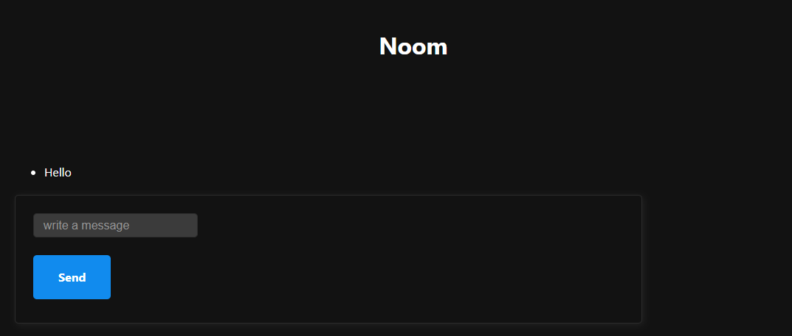


🎈Form을 만들어서 nickname을 정할 수 있게 한다.

**home.pug**

```pug
doctype html
html(lang="en")
    head
        meta(charset="UTF-8")
        meta(http-equiv="X-UA-Compatible", content="IE=edge")
        meta(name="viewport", content="width=device-width, initial-scale=1.0")
        title Noom
        link(rel="stylesheet" href="https://unpkg.com/mvp.css")
    body 
        header
            h1 Noom
        main
            form
                input(type="text", placeholder="choose a nickname", required)
                button Save
            ul
            form
                input(type="text", placeholder="write a message", required)
                button Send
        script(src="public/js/app.js")
```

:x:Backend는 message를 구분하지 못하는 상태이다.

메시지를 구별해주는 방법이 필요하다.

:heavy_check_mark:form이 두개가 되었기 때문에 id를 설정해준다.

```pug
doctype html
html(lang="en")
    head
        meta(charset="UTF-8")
        meta(http-equiv="X-UA-Compatible", content="IE=edge")
        meta(name="viewport", content="width=device-width, initial-scale=1.0")
        title Noom
        link(rel="stylesheet" href="https://unpkg.com/mvp.css")
    body 
        header
            h1 Noom
        main
            form#nick
                input(type="text", placeholder="choose a nickname", required)
                button Save
            ul
            form#message
                input(type="text", placeholder="write a message", required)
                button Send
        script(src="public/js/app.js")
```


**app.js**

```js
const messageForm = document.querySelector("#message");
const nickForm = document.querySelector("#nick");

function handleSubmit(event){
  event.preventDefault();
  const input = messageForm.querySelector("input");
  socket.send(input.value);
  input.value = "";
};

function handleNickSubmit(event){
  event.preventDefault();
  const input = nickForm.querySelector("input");
  socket.send(input.value);
};

messageForm.addEventListener("submit",handleSubmit);
nickForm.addEventListener("submit", handleNickSubmit);
```

:ballot_box_with_check:message에 두개의 type이 있다.(message, nickname)

앞으로는 text 대신 JSON을 보낼 예정이다.

**app.js**

```js
function handleNickSubmit(event){
  event.preventDefault();
  const input = nickForm.querySelector("input");
  socket.send({
    type:"nickname",
    payload: input.value,
  });
};
```

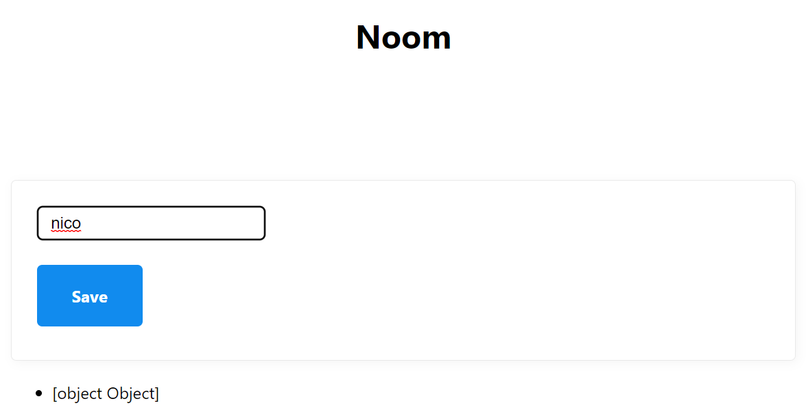

🎇 JavaScript object를 가지고 string으로 만드는 가장 좋은 방법은? `JSON.stringify`

🎇 그 String을 다시 JavaScript object로 만드는 방법은? `JSON.parse`

Browser에서 Text를 보낸다. 우리는 Object를 가져와 String으로 바꿔줄 것이다.

String으로 바뀐 Object은 Backend로 전송되고 Backend에서는 그 String을 다시 Object로 바꾸어준다.

**반대도 동일하다**


**app.js**

```js
function makeMessage(type, payload){
  const msg ={type, payload};
  return JSON.stringify(msg);
};

function handleSubmit(event){
  event.preventDefault();
  const input = messageForm.querySelector("input");
  socket.send(makeMessage("new_message", input.value));
  input.value = "";
};

function handleNickSubmit(event){
  event.preventDefault();
  const input = nickForm.querySelector("input");
  socket.send(makeMessage("nickname", input.value));
};
```

**Now**

Backend로 메시지를 전송할 때마다 우리는 String을 전송해 줄 것이다.

하지만 String을 전송하기 전에 Object를 만들고 그 Object를 String으로 만들었다.

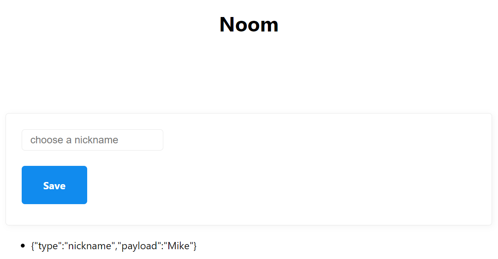


### Nicknames part Two

Back-end로 String을 보내 준다.

String의 모양은 목정에 따라서 달라진다.

**Front-end**

1. Chat으로 보내는 Message
2. Nickname을 변경하고 싶을 때 Backend로 보내는 Message

두 개의 다른 Form에 전송된다.

🎈 

Backend가 Javascript object를 이해하지 못한다. 따라서 JavaScript Object를 보내면 좋지 않다.

**:keyboard: JSON.stringify**: JavaScript object -> String

연결하고 싶은 Frontend와 Backend server가 Javascript server가 아닐 수 있고 Java, GO server일 수 있다.

따라서 String을 보내야한다.

그리고 모든 서버는 그 String을 가지고 무엇을 할지 정한다.

:heavy_check_mark: Front에서 Back으로 보내서 Back이 받는 String:

보내진 String을 JavaScript로 만들어야 type을 확인할 수 있다.

**:keyboard: JSON.parse()**: String -> JavaScript object

**sever.js**

```js
wss.on("connection", (socket) => {
  sockets.push(socket);
  console.log("Connected to Browser ✔");
  socket.on("close", () => console.log("Disconnected from Browser ❌"));
  socket.on("message", (message) => {
    const parsed = JSON.parse(message);
    console.log(parsed, message.toString());
    sockets.forEach((aSocket) => aSocket.send(message.toString()));
  });
});
```

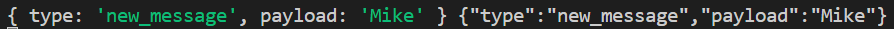

```js
wss.on("connection", (socket) => {
  sockets.push(socket);
  console.log("Connected to Browser ✔");
  socket.on("close", () => console.log("Disconnected from Browser ❌"));
  socket.on("message", (message) => {
    const parsed = JSON.parse(message);
    if (parsed.type === "new_message"){
      sockets.forEach((aSocket) => aSocket.send(parsed.payload));
    };
  });
});
```

Message는 Type(Message의 종류)와 payload(Message에 담겨있는 중요한 정보)을 가지고 있다.

```js
wss.on("connection", (socket) => {
  sockets.push(socket);
  console.log("Connected to Browser ✔");
  socket.on("close", () => console.log("Disconnected from Browser ❌"));
  socket.on("message", (message) => {
    const parsed = JSON.parse(message);
    if (parsed.type === "new_message"){
      sockets.forEach((aSocket) => aSocket.send(parsed.payload));
    } else if(parsed.type === "nickname"){
      console.log(parsed.payload);
    }
  });
});
```


**if-else문** :arrow_forward: **switch문**

```js
wss.on("connection", (socket) => {
  sockets.push(socket);
  console.log("Connected to Browser ✔");
  socket.on("close", () => console.log("Disconnected from Browser ❌"));
  socket.on("message", (message) => {
    const parsed = JSON.parse(message);
    switch(parsed.type){
      case "new_message":
        sockets.forEach((aSocket) => aSocket.send(parsed.payload));
      case "nickname":
        console.log(parsed.payload);
    }
  });
});
```


:heavy_check_mark:payload인 nickname을 socket안에 넣어주어야한다. => socket이 누구인지 알고 싶다.

`socket["nickname"] = parsed.payload;`

```js
wss.on("connection", (socket) => {
  sockets.push(socket);
  console.log("Connected to Browser ✔");
  socket.on("close", () => console.log("Disconnected from Browser ❌"));
  socket.on("message", (message) => {
    const parsed = JSON.parse(message);
    switch(parsed.type){
      case "new_message":
        sockets.forEach((aSocket) => aSocket.send(parsed.payload));
      case "nickname":
        socket["nickname"] = parsed.payload;
    }
  });
});
```


**nickname을 설정안한 사람의 경우도 설정해준다. **

`socket["nickname"] = "Anonymous";`

```js
wss.on("connection", (socket) => {
  sockets.push(socket);
  socket["nickname"] = "Anonymous";
  console.log("Connected to Browser ✔");
  socket.on("close", () => console.log("Disconnected from Browser ❌"));
  socket.on("message", (message) => {
    const parsed = JSON.parse(message);
    switch(parsed.type){
      case "new_message":
        sockets.forEach((aSocket) => aSocket.send(parsed.payload));
      case "nickname":
        socket["nickname"] = parsed.payload;
    }
  });
});
```


**nickname와 message**

`sockets.forEach((aSocket) => aSocket.send(`${socket.nickname}: ${parsed.payload}`));`

```js
wss.on("connection", (socket) => {
  sockets.push(socket);
  socket["nickname"] = "Anonymous";
  console.log("Connected to Browser ✔");
  socket.on("close", () => console.log("Disconnected from Browser ❌"));
  socket.on("message", (message) => {
    const parsed = JSON.parse(message);
    switch(parsed.type){
      case "new_message":
        sockets.forEach((aSocket) => aSocket.send(`${socket.nickname}: ${parsed.payload}`));
      case "nickname":
        socket["nickname"] = parsed.payload;
    }
  });
});
```

**Chrome: nickname 없이 Hello (send)**

**edge: nickname Micro와 함께 Hi (send)**

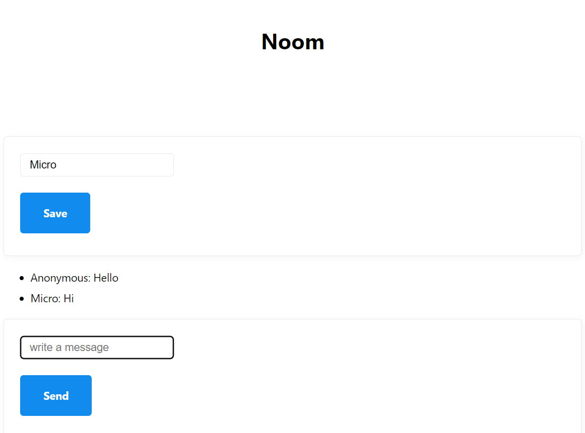

:white_check_mark: socket에 information을 저장할 수 있다!


:heavy_plus_sign:nickname을 사용 후 비워준다.

**app.js**

``input.value = "";`

```js
const messageList = document.querySelector("ul");
const messageForm = document.querySelector("#message");
const nickForm = document.querySelector("#nick");
const socket = new WebSocket(`ws://${window.location.host}`);

function makeMessage(type, payload){
  const msg ={type, payload};
  return JSON.stringify(msg);
};

socket.addEventListener("open", () => {
  console.log("Connected to Server ✔");
});

socket.addEventListener("message", (message) => {
  const li = document.createElement("li");
  li.innerText = message.data;
  messageList.append(li);
});

socket.addEventListener("close", () => {
  console.log("Disconnected to Server ❌");
});

function handleSubmit(event){
  event.preventDefault();
  const input = messageForm.querySelector("input");
  socket.send(makeMessage("new_message", input.value));
  input.value = "";
};

function handleNickSubmit(event){
  event.preventDefault();
  const input = nickForm.querySelector("input");
  socket.send(makeMessage("nickname", input.value));
  input.value = "";
};

messageForm.addEventListener("submit",handleSubmit);
nickForm.addEventListener("submit", handleNickSubmit);
```


### Conclusions

Things could be improve!

Message를 보낸 사람을 제외한 모든 사람에게 Message를 보낸다.

`const li = document.createElement("li");`

`li.innerText = `You: ${input.value}`;`

`messageList.append(li);`

**app.js**

```js
const messageList = document.querySelector("ul");
const messageForm = document.querySelector("#message");
const nickForm = document.querySelector("#nick");
const socket = new WebSocket(`ws://${window.location.host}`);

function makeMessage(type, payload){
  const msg ={type, payload};
  return JSON.stringify(msg);
};

socket.addEventListener("open", () => {
  console.log("Connected to Server ✔");
});

socket.addEventListener("message", (message) => {
  const li = document.createElement("li");
  li.innerText = message.data;
  messageList.append(li);
});

socket.addEventListener("close", () => {
  console.log("Disconnected to Server ❌");
});

function handleSubmit(event){
  event.preventDefault();
  const input = messageForm.querySelector("input");
  socket.send(makeMessage("new_message", input.value));
  input.value = "";
};

function handleNickSubmit(event){
  event.preventDefault();
  const input = nickForm.querySelector("input");
  socket.send(makeMessage("nickname", input.value));
  const li = document.createElement("li");
  li.innerText = `You: ${input.value}`;
  messageList.append(li);
  input.value = "";
};

messageForm.addEventListener("submit",handleSubmit);
nickForm.addEventListener("submit", handleNickSubmit);
```

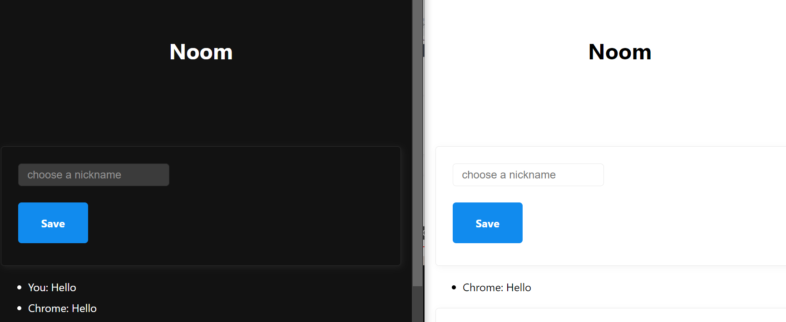


**나를 제외한 다른 모두에게 메시지를 전송해주는 function을 만들고 싶다.**

**여러 종류의 Message type을 구분하여 사용할 수 있는 경우 존재**

"Framework 사용할 것이다"

현재는 모든 것들이 socket message 안에 들어가야한다.

우리가 Message type을 확인하고 사용했었다.

addEventListener를 계속 사용한다. => front-end에서도 socket.on("join"); 등을 쓸 수 있다.


## #2 SOCKETIO

### SocketIO vs WebSockets

SocketIO **framework**

Socket.IO enables real-time, bidirectional and event-based communication.

(sounds similar with WebSockets)

It works on every platform, browser or device, focusing equally on realiability and speed.

**Socket IO is more resilient then WebSocket**

websocket은 Socket IO가 실시간, 양방향, event 기반 통신을 제공하는 방법 중 하나이다.

If some browser or  phone not support the websocket.

:heavy_check_mark:websocket에 문제가 생겨도 socket IO는 계속 작동한다.

Socket IO는 webocket의 부가기능이 아니다.(Socket.IO is **NOT** a WebSocet implementation.)

Socket IO는 webSocket을 이용하여 Framework로 실시간, 양방향, event 기반 통신을 제공한다.


:white_check_mark:Browser가 websocket 사용이 가능하다면 socket IO는 websocket을 이용한다.

(만약 firewall, proxy가 있어도 socket IO는 계속 작동한다.)

:white_check_mark:websocket을 지원하지 않으면 HTTP long polling과 같은 다른 것을 사용한다.

:white_check_mark:Socket IO의 경우에는 만약 wifi연결이 잠시동안 끊겨도 socket IO은 재연결을 시도한다.

🎈 socket IO gives you reliability

<u>socket IO is heavier than websocket</u>


### Installing SocketIO

Websocket 대신에 socketIO를 이용한다.

```bash
$ npm i socket.io
```

**server.js**

```js
import WebSocket from "ws";
const wss = new WebSocket.Server({server});
```


```js
import SocketIO from "socket.io";
const httpServer = http.createServer(app);
const wsServer = SocketIO(httpServer);
httpServer.listen(3000, handleListen);
```

:exclamation:socket IO가 url을 준다.

localhost:3000/socket.io/socket.io.js

:heavy_check_mark: 이렇게 해야하는 이유

SocketIO가 WebSocket의 부가기능이 아니기 때문이다.

SocketIo는 재연결과 같은 부가기능이 있다.

client에도 socketIO를 설치해야한다.

websocket을 사용할 때는 backend에 설치가 필요하지 않았다. Browser가 제공하는 WebSocket API 사용했다.

하지만 Browser가 주는 Websocket은 Socket IO와 호환이 되지 않는다. (Socket IO의 기능이 많기 때문이다.)


**URL을 주어서 front-end에서는 이걸 쉽게 import할 수 있다.**

이제 socket IO가 front-end와 Back-end에 설치 될 것이다.

**app.js**의 코드를 전부지우고 시작하고 **home.pug**의 main의 코드도 모두 지운다.


:large_blue_circle: User가 Chat에 참가하고 싶으면 Room을 먼저 만들도록 하고 싶다.

더이상 public chat을 사용하지 않을 것이다.

이것을 해주기 전에 socketIO를 꼭 설치해야 한다.

**home.pug**

```pug
doctype html
html(lang="en")
    head
        meta(charset="UTF-8")
        meta(http-equiv="X-UA-Compatible", content="IE=edge")
        meta(name="viewport", content="width=device-width, initial-scale=1.0")
        title Noom
        link(rel="stylesheet" href="https://unpkg.com/mvp.css")
    body 
        header
            h1 Noom
        main
        script(src="/socket.io/socket.io.js")
        script(src="public/js/app.js")
```


**server.js**

backend에서 connection을 받을 준비가 되어있다.

새로운 connection을 등록할 준비가 되었다.

`wsServer.on("connection", socket => { console.log(socket);});`

```js
import http from "http";
import SocketIO from "socket.io";
import express from "express";

const app = express();

app.set("view engine", "pug");
app.set("views", __dirname + "/views");
app.use("/public", express.static(__dirname + "/public"));
app.get("/", (_, res) => res.render("home"));
app.get("/*", (_, res) => res.render("/"));
const handleListen = () => console.log(`Listening on ws://localhost:3000`);

const httpServer = http.createServer(app);
const wsServer = SocketIO(httpServer);

wsServer.on("connection", socket => {
  console.log(socket);
});
httpServer.listen(3000, handleListen);
```

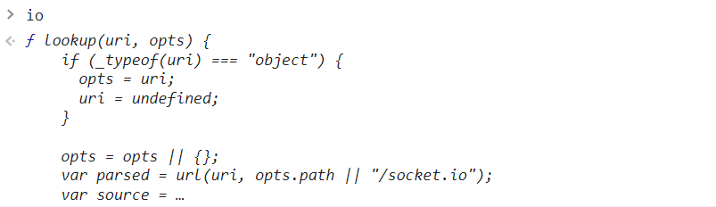

**app.js**

socketIO을 front-end와 연결

```js
const socket = io();
```

🎈port, ws을 쓰지 않아도 된다.

io function이 알아서 socket.io을 실행하고 있는 server를 찾는다.

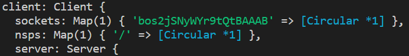

:ballot_box_with_check: backend에서 sockets에 socket id를 확인할 수 있다.
